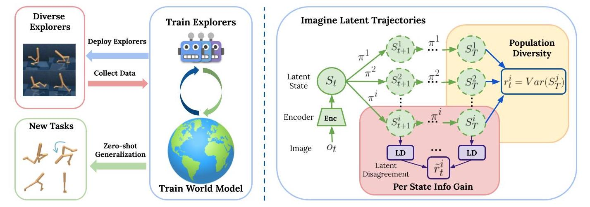

# Learning General World Models in a Handful of Reward-Free Deployments

[[Project Website](https://ycxuyingchen.github.io/cascade/)]

Implementation of CASCADE in [Learning General World Models in a Handful of Reward-Free Deployments](https://arxiv.org/abs/2210.12719).

CASCADE is a novel approach for self-supervised exploration in the reward-free deployment efficient setting. It seeks to learn a world model by collecting data with a population of agents, using an information theoretic objective inspired by Bayesian Active Learning. CASCADE achieves this by specifically maximizing the diversity of trajectories sampled by the population through a novel cascading objective.




## Install Dependencies
```
pip3 install tensorflow==2.6.0 keras=2.6 tensorflow_probability ruamel.yaml 'gym[atari]' dm_control pycparser scikit-learn scipy gym_minigrid
```

## Run
Example: train a population of 10 CASCADE agents on Crafter, collecting 50k steps per deployment.
```
python main.py --task=crafter_noreward --xpid=test_cascade_walker --num_agents=10 --cascade_alpha=0.1 --train_every=50000 --envs=10 --offline_model_train_steps=5001
```

## Reference
If you find this work useful, please cite:
```
@article{xu2022cascade,
  title = {Learning General World Models in a Handful of Reward-Free Deployments},
  doi = {10.48550/ARXIV.2210.12719},
  author = {Xu, Yingchen and Parker-Holder, Jack and Pacchiano, Aldo and Ball, Philip J. and Rybkin, Oleh and Roberts, Stephen J. and Rocktäschel, Tim and Grefenstette, Edward},
  publisher = {arXiv},
  url = {https://arxiv.org/abs/2210.12719},
  year = {2022},
}
```

## License
The majority of CASCADE is licensed under CC-BY-NC, however portions of the project are available under separate license terms: https://github.com/danijar/dreamerv2 is licensed under the MIT license.
